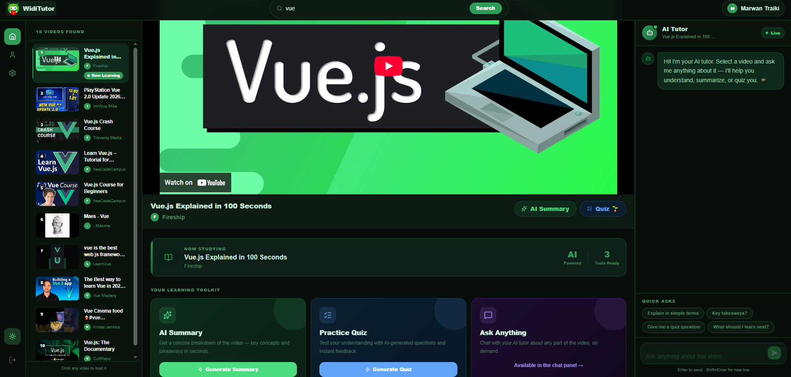
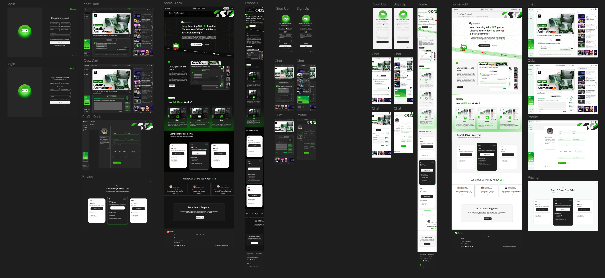
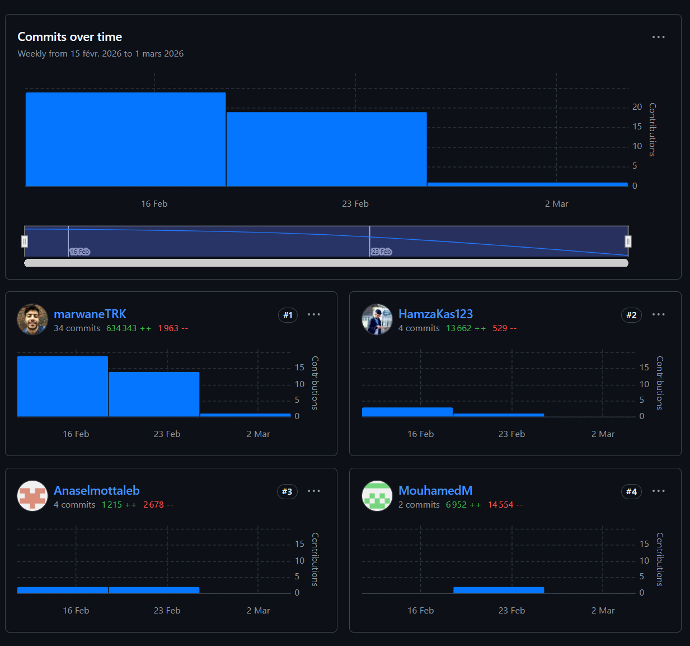
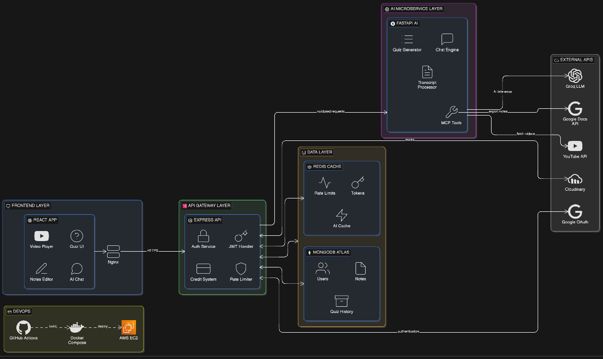

# WidiTutor

Plateforme d'apprentissage basée sur l'IA qui aide les étudiants à mieux comprendre le contenu vidéo grâce à l'extraction de transcripts, la génération de résumés, des quiz et un chat contextuel.

## Aperçu du Projet




## Description

WidiTutor centralise un workflow d'étude moderne dans une seule application web. Les utilisateurs peuvent se connecter, consulter du contenu, générer des résumés, créer des quiz à partir de transcripts et interagir avec un assistant IA.

Le projet suit une architecture full-stack avec un frontend React et un backend Express connecté à MongoDB.

## Fonctionnalités

- Authentification sécurisée (email/mot de passe + Google OAuth)
- Vérification email et réinitialisation du mot de passe
- Profil utilisateur protégé avec upload d'avatar
- Workflow IA pour l'apprentissage :
  - Recherche de vidéos
  - Récupération de transcripts
  - Génération de résumés
  - Génération de quiz
  - Chat contextuel
- Abonnement et paiement via Stripe
- Limitation d'usage selon le plan utilisateur

## Stack Technique

- Frontend : React 19, Vite, React Router, Tailwind CSS
- Backend : Node.js, Express 5, Mongoose
- Base de données : MongoDB
- Paiement : Stripe
- Média : Cloudinary
- DevOps : Docker Compose

## Structure du Projet

```bash
widiTutor_dev/
|-- express/
|   |-- src/
|   |   |-- config/
|   |   |-- controllers/
|   |   |-- helpers/
|   |   |-- middleware/
|   |   |-- model/
|   |   |-- routes/
|   |   |-- services/
|   |   |-- utils/
|   |   `-- validation/
|   |-- index.js
|   |-- example.env
|   `-- package.json
|-- frontend/
|   |-- src/
|   |   |-- assets/
|   |   |-- components/
|   |   |-- layouts/
|   |   |-- pages/
|   |   |-- services/
|   |   `-- utils/
|   |-- Dockerfile
|   `-- package.json
|-- docker-compose.yml
|-- LICENSE
`-- README.md
```

## Variables d'Environnement (Essentiel MERN)

Dans `express/.env` :

```env
MONGO_URI=
JWT_SECRET=
```

## Installation et Lancement

### Prérequis

- Node.js 18+
- npm
- MongoDB (local ou Atlas)
- Docker + Docker Compose (optionnel)

### Lancement en local

1. Backend

```bash
cd express
npm install
npm run dev
```

2. Frontend

```bash
cd frontend
npm install
npm run dev
```

### Lancement avec Docker

```bash
docker compose up --build
```

## Endpoints Principaux

- Auth : `/api/auth/*`
- IA : `/api/generate-summary`, `/api/generate-quiz`, `/api/chat`, `/api/search-videos`, `/api/get-transcript`
- Billing : `/api/billing/*`
- Health : `/health`

## Design



## Contributions Équipe



## Aperçu Architecture



## Notes

- `fastapi/` n'est pas inclus dans ce dépôt (protection).
- Les endpoints IA peuvent nécessiter un service FastAPI privé en déploiement.
- Pas de lien de déploiement public pour le moment.

## Équipe

- Marwan Traiki : marwantraiki@gmail.com
- Anas : anas@gmail.com
- Mohamed : mohamed@gmail.com
- Hamza : hamza@gmail.com

## Licence

Ce projet est sous licence MIT. Voir [LICENSE](./LICENSE).
